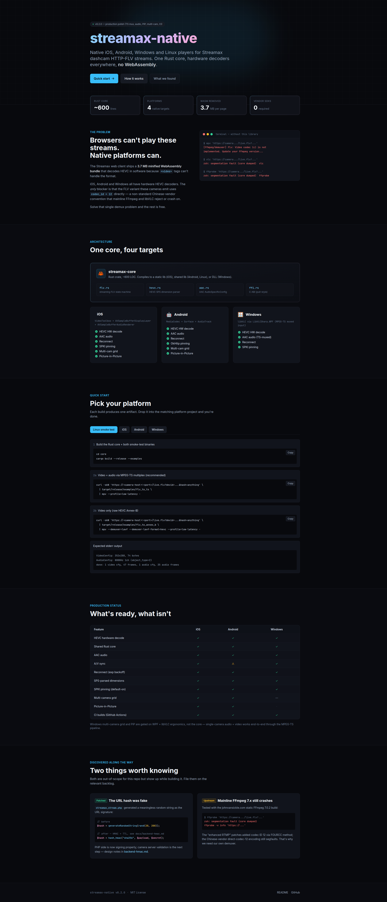

# streamax-native

Native iOS / Android / Windows / Linux players for Streamax (and similar Chinese
MDVR) HTTP-FLV live streams. **Bypasses** the proprietary 3.7 MB WebAssembly
player vendors ship for the web.

A shared Rust core does the FLV demuxing once; thin platform wrappers feed
hardware decoders (VideoToolbox / MediaCodec / DXVA via libVLC).

## Visual walkthrough

A full HTML walkthrough with tabbed build instructions for each platform lives
at [`docs/index.html`](docs/index.html). Open it locally:

```bash
xdg-open docs/index.html     # Linux
open docs/index.html         # macOS
start docs\index.html        # Windows
```

Preview:

[](docs/index.html)

*Click the image to open the interactive version (tabs and tables are powered
by Alpine.js — they only work in a real browser, not in GitHub's image
preview).*

## Why this exists

The web client these cameras ship with is a `streamaxPlayer` WebAssembly
bundle that decodes HEVC in software because browsers can't play it natively.
On mobile and desktop the same constraint doesn't apply — every modern
platform has a hardware HEVC decoder. The blocker for "just use ffmpeg / VLC"
is that the FLV variant the cameras emit uses **codec_id 12 (HEVC) directly**
in the video tag header — a non-standard Chinese-vendor convention that
mainline FFmpeg and libVLC either reject or crash on.

This project ships a tiny demuxer that handles exactly that variant, and three
native players built on top of it.

## Architecture

```
                ┌──────────────────────────────────┐
                │  streamax-core  (Rust, ~600 LOC) │
                │                                  │
                │  FLV state machine               │
                │  HEVC SPS dimension parser       │
                │  AAC AudioSpecificConfig parser  │
                │  C ABI (pull-style events)       │
                └──────────────┬───────────────────┘
                               │
        ┌──────────────────────┼──────────────────────┐
        │                      │                      │
  iOS (Swift)           Android (Kotlin)         Windows (.NET)
  VideoToolbox          MediaCodec               libVLC
  AVAudioRenderer       AudioTrack               (audio: TODO)
```

## What's in here

| Directory  | Contents                                                          |
| ---------- | ----------------------------------------------------------------- |
| `core/`    | Rust crate — demuxer + parsers + C ABI + build script             |
| `ios/`     | Swift player (HEVC + AAC, reconnect, SPKI pinning, SwiftUI demo)  |
| `android/` | Kotlin player (HEVC + AAC, reconnect, OkHttp pinning, Compose UI) |
| `windows/` | C# WPF player (HEVC via libVLC, reconnect, SPKI pinning)          |
| `tools/`   | Python demuxer + Tk demo for Linux smoke-testing                  |
| `docs/`    | HTML build / usage walkthrough (open `docs/index.html` locally)   |

## Quick start (Linux smoke test)

The fastest way to confirm the recipe works against your camera:

```bash
# 1. Build the Rust core
cd core && cargo build --release --examples

# 2. Get a fresh URL from the PHP backend (DevTools → /request/dashcam_getstream)
URL='https://<camera-host>:<port>/live.flv?devid=...&chl=1&st=1&audio=1&hash=anything'

# 3a. Video only (raw HEVC Annex-B)
curl -skN "$URL" \
  | target/release/examples/flv_to_annex_b \
  | mpv --demuxer=lavf --demuxer-lavf-format=hevc --profile=low-latency -

# 3b. Video + audio (MPEG-TS multiplex)
curl -skN "$URL" \
  | target/release/examples/flv_to_ts \
  | mpv --profile=low-latency -
```

Stderr reports detected resolution, codec, sample rate, and frame counts.

## Building per platform

See [docs/index.html](docs/index.html) for the visual walkthrough. TL;DR:

| Platform | Command                              | Output                          |
| -------- | ------------------------------------ | ------------------------------- |
| Linux    | `core/build.sh linux`                | `libstreamax_core.{a,so}`       |
| iOS      | `core/build.sh ios` (macOS + Xcode)  | `StreamaxCore.xcframework`      |
| Android  | `core/build.sh android` (NDK)        | `libstreamax_core.so` per ABI   |
| Windows  | `core/build.sh windows`              | `streamax_core.dll`             |

Then drop the artifact into the matching platform project and open in Xcode /
Android Studio / Visual Studio.

## Production status

| Feature                          | iOS | Android | Windows |
| -------------------------------- | --- | ------- | ------- |
| HEVC hardware decode             | ✅  | ✅      | ✅      |
| AAC audio                        | ✅  | ✅      | ✅      |
| Reconnect (exp backoff)          | ✅  | ✅      | ✅      |
| SPS-parsed dimensions            | ✅  | ✅      | ✅      |
| SPKI cert pinning (default-on)   | ✅  | ✅      | ✅      |
| A/V sync                         | ✅  | ⚠️      | ✅      |
| Multi-camera grid                | ✅  | ✅      | —       |
| Picture-in-Picture               | ✅  | ✅      | —       |
| CI builds (GitHub Actions)       | ✅  | ✅      | ✅      |

See `docs/index.html` → "Production status" for the live checklist.

## Findings worth knowing about

While building this we discovered two things on the server side worth fixing.
The PHP-side change is already applied; the camera-server side is documented
in [`docs/backend-hmac.md`](docs/backend-hmac.md).

1. **The `hash` URL parameter was fake.** `streamax_stream.php:34` used to call
   `generateRandomString(rand(20,200))` and the camera server didn't validate.
   The PHP side now generates a real HMAC-SHA256 with TTL when a secret is
   configured; the camera server still ignores it (forward-compatible). When
   the camera server learns to validate, no client code changes.

2. **Mainline FFmpeg ≥ 7.0 still doesn't demux the HEVC-in-FLV variant.** Ours
   sometimes crashes (`ffprobe` segfault). The streams *can* be played — just
   not through stock FLV demuxers. Hence this project.

## License

MIT. See `LICENSE`.
